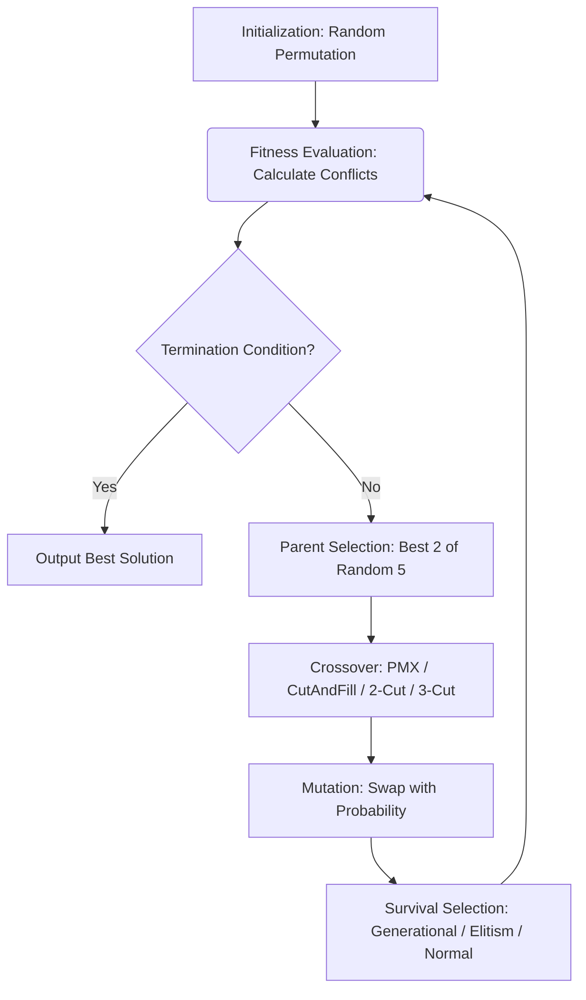

# 🧬 N-Queens Genetic Algorithm Solver

[](https://www.python.org/)
[](https://opensource.org/licenses/MIT)
[](https://github.com/psf/black)

A modular, highly configurable Genetic Algorithm (GA) implementation designed to solve the N-Queens problem. This project explores parameter sensitivity, crossover strategies, survival selection mechanisms, and scalability (from N=8 to N=20).

## 🏗 Architecture & Workflow

The GA lifecycle is modularized into distinct components:



## 📊 Performance Metrics

Based on extensive benchmarking (50 runs per configuration), the algorithm achieves the following:

* **Success Rate:** 100% across all tested configurations for N=8.
* **Average Convergence Speed:** ~76 to 215 generations (depending on mutation/crossover rates).
* **Crossover Efficiency:** PMX (Partially Mapped Crossover) demonstrated a faster average convergence (78.0 generations) compared to Cut-and-Fill (101.58 generations).
* **Survival Strategy:** Elitism provided the most stable and consistent results, converging in ~2–3 generations on average for N=8, compared to Generational Replacement.
* **Scalability (N=10):** Average convergence in ~165.2 generations.

## 🚀 Quick Start

### Prerequisites

* Python 3.9+
* `pip` and `virtualenv`

### Installation & Execution

```bash
# 1. Clone the repository
git clone https://github.com/yourusername/n-queens-ga.git
cd n-queens-ga

# 2. Create a virtual environment and install dependencies
python -m venv venv
source venv/bin/activate  # On Windows: venv\Scripts\activate
pip install -r requirements.txt

# 3. Configure environment variables
cp .env.example .env
# Edit .env to set N, MAX_POPULATION, RUNS, etc.

# 4. Run the GA
python src/main.py --n 8 --runs 50 --crossover pmx --survival elitism
```

## 📁 Project Structure

```text
n-queens-ga/
├── src/                    # Core source code
│   ├── config.py           # Hyperparameters and environment variables
│   ├── fitness.py          # Conflict calculation logic
│   ├── operators.py        # Genetic operators (Crossover, Mutation)
│   ├── selection.py        # Parent and Survival selection strategies
│   └── main.py             # CLI orchestration and execution loop
├── tests/                  # Unit tests (pytest)
├── results/                # Generated plots and benchmark logs
├── requirements.txt        # Python dependencies
├── BENCHMARKS.md           # Detailed experimental results
└── README.md
```

## 🔌 API & CLI Usage

This project is exposed as a CLI tool using `argparse`.

**Example Command:**

```bash
python src/main.py --n 8 --runs 50 --crossover pmx --survival elitism --mutation-rate 20
```

**Example JSON Output** (logged to `results/logs/run_2023.json`):

```json
{
  "config": {
    "n": 8,
    "runs": 50,
    "crossover": "PMX",
    "survival": "Elitism",
    "mutation_rate": 20
  },
  "metrics": {
    "success_rate": 100.0,
    "average_generations": 78.0,
    "best_solution": [4, 7, 1, 8, 5, 2, 6, 3]
  }
}
```

## 🔐 Security & Configuration

All hyperparameters are managed via environment variables to avoid hardcoding. Create a `.env` file based on `.env.example`:

```env
N=8
MAX_POPULATION=100
RUNS=50
CROSSOVER_METHOD=pmx
SURVIVAL_STRATEGY=elitism
MUTATION_RATE=20
CROSSOVER_RATE=100
```

## 🔮 Future Improvements

* **Parallelization:** Implement `multiprocessing` or `joblib` to run multiple independent GA instances concurrently.
* **Adaptive Rates:** Dynamically adjust mutation and crossover rates based on population diversity.
* **Scalability Optimization:** Implement a more efficient conflict calculation (O(N) instead of O(N²)) to handle N > 50.
* **Dashboard:** Integrate Streamlit or Dash for real-time visualization of the GA convergence.
